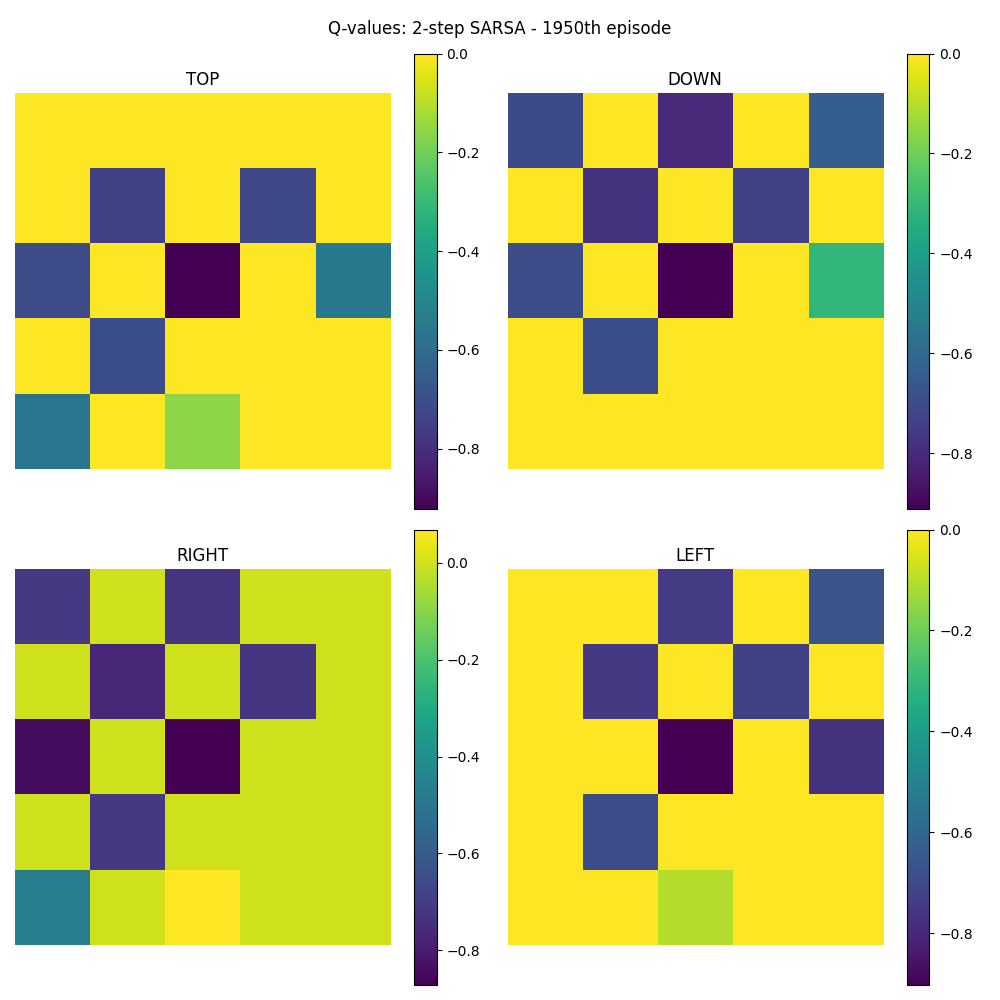
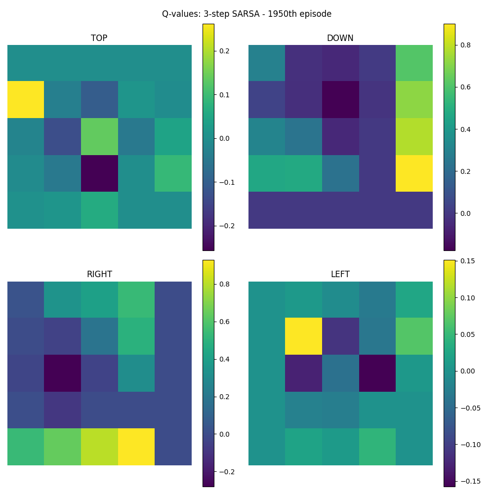
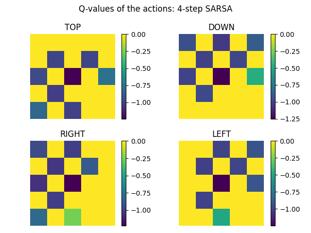
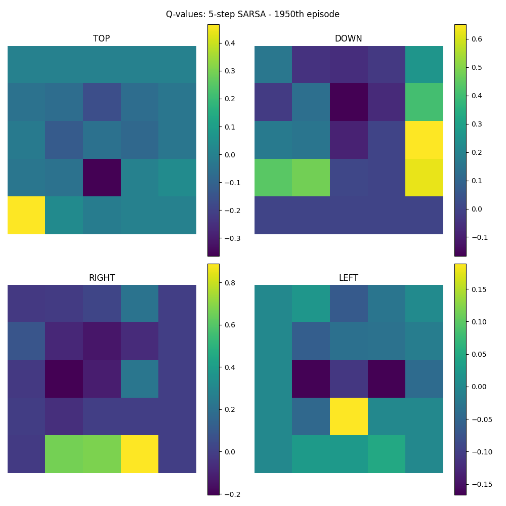

# Deep reinforcement learning - Homework 02
## by Moritz Lönker and Tim Niklas Witte 

# Enviroment


```bash
1 0 0 0 0 
0 0 0 0 0 
0 0 - 0 0 
0 0 0 ☐ 0 
0 0 0 0 $ 

Legend:
1 = Current position of the agent
0 = Empty, reward = 0
$ = Terminal state, reward = 1 
- = State to avoid, reward = -1
☐ = Obstacle
---------------------------------
```

# 1-step SARSA


# 2-step SARSA



# 3-step SARSA



# 4-step SARSA



# 5-step SARSA

