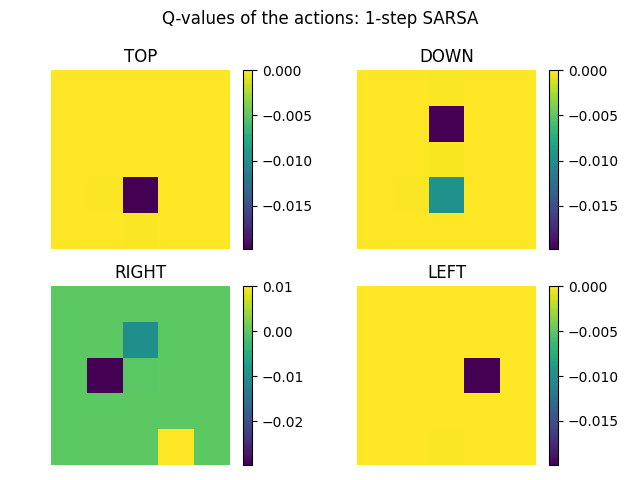
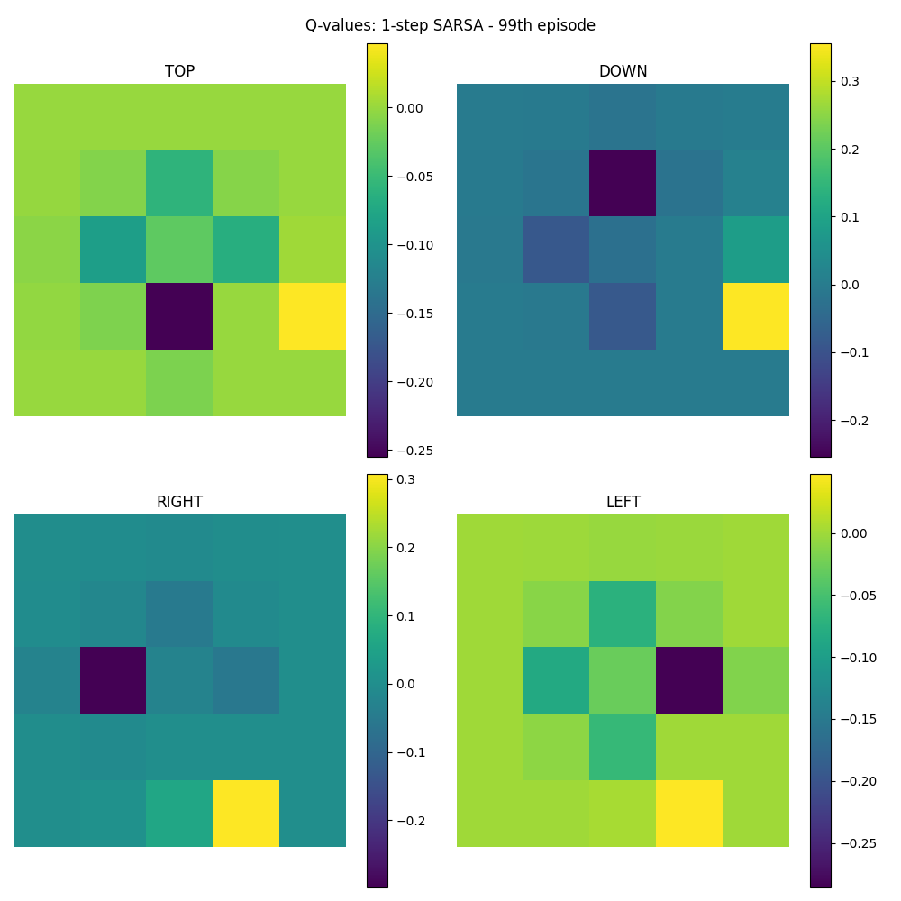
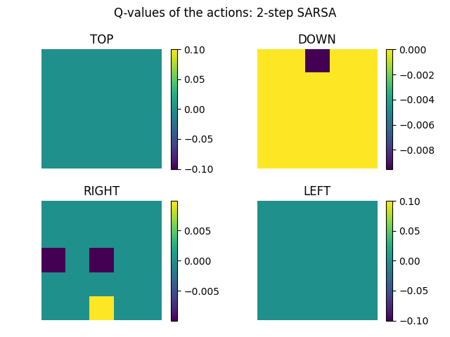
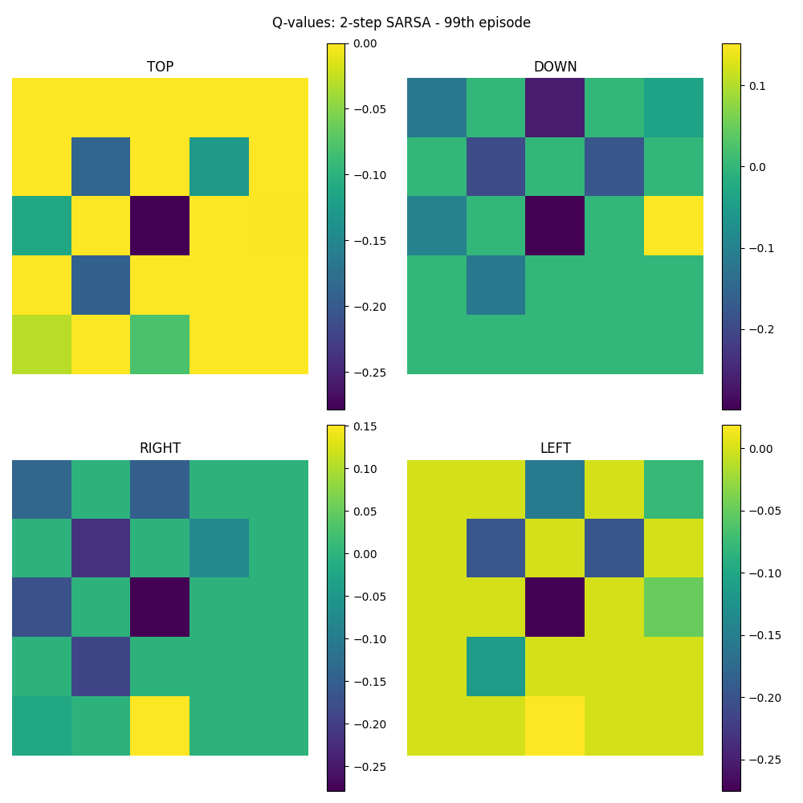
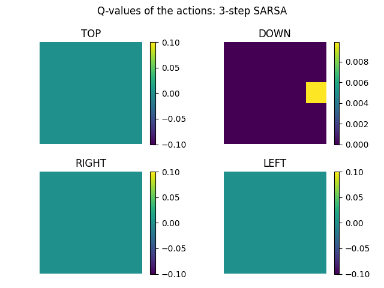
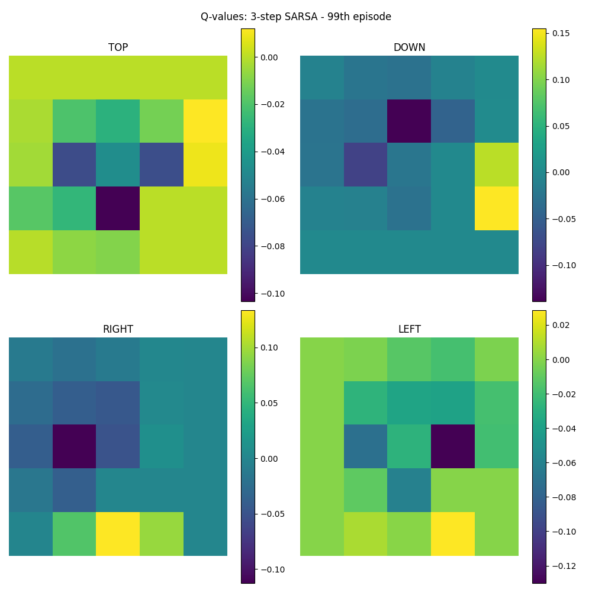
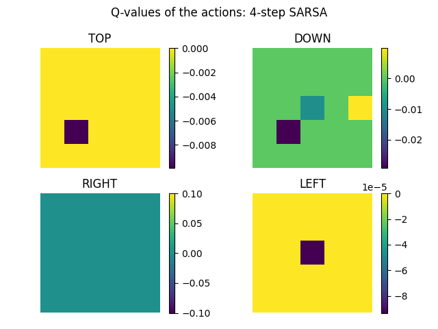
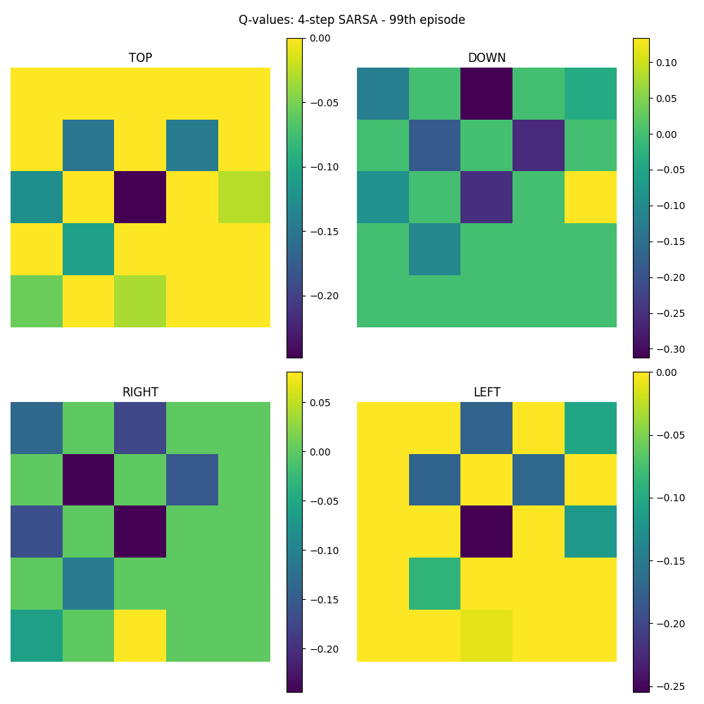
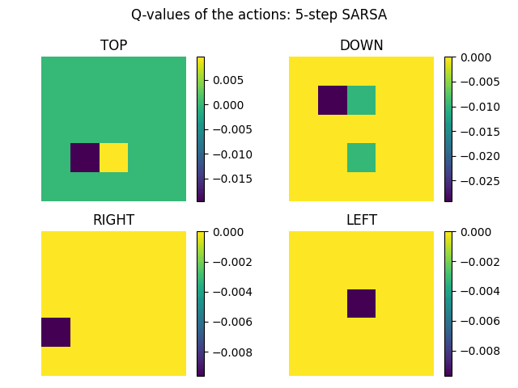
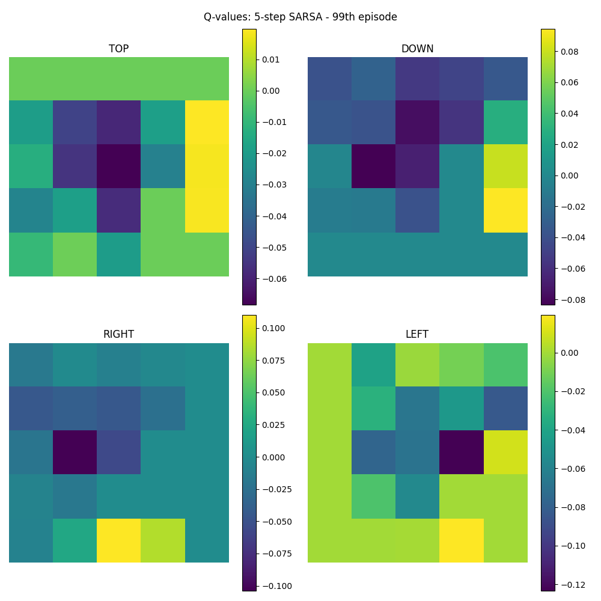

# Deep reinforcement learning - Homework 02
## by Moritz Lönker and Tim Niklas Witte 

# Usage

```bash

usage: Main.py [-h] [--n N] [--MC MC] [--plot PLOT] [--episodes EPISODES]
               [--alpha ALPHA] [--gamma GAMMA]

Present the MC or n-step SARSA algorithm. After desired number of episodes is executed the
Q-Table is plotted: Each Q-value for each action is presented.

optional arguments:
  -h, --help           show this help message and exit
  --n N                Set the n in n step SARSA (default = 1)
  --MC MC              Use MC instead of SARSA
  --plot PLOT          Set X. Each X times the current Q-Table will be plotted
                       and stored in
                       ./Plots/{n_sarsa}-step_SARSA/episode_{num_episode}. The
                       directory will be created if it does not exists.
                       (default = 0 -> create no plots)
  --episodes EPISODES  Set the number of episodes (default = 100)
  --alpha ALPHA        Set the learning rate (default = 0.01)
  --gamma GAMMA        Set the discount factor (default = 0.99)

```

# Enviroment


```bash
1 0 0 0 0 
0 0 0 0 0 
0 0 - 0 0 
0 0 0 ☐ 0 
0 0 0 0 $ 

Legend:
1 = Current position of the agent
0 = Empty, reward = 0
$ = Terminal state, reward = 1 
- = State to avoid, reward = -1
☐ = Obstacle
---------------------------------
```

# 1-step SARSA



# 2-step SARSA



# 3-step SARSA



# 4-step SARSA



# 5-step SARSA

