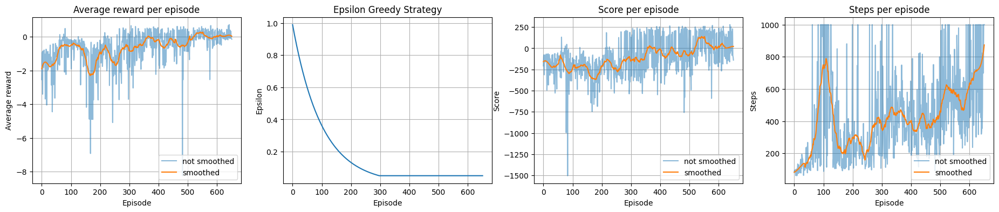
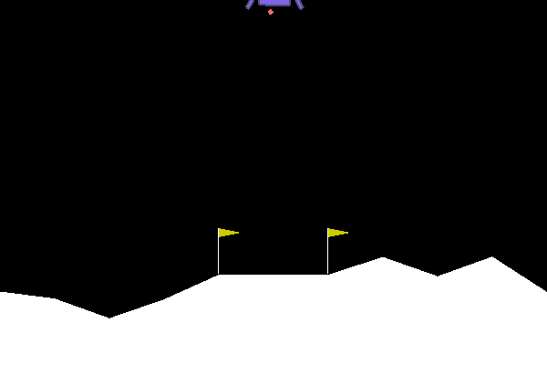
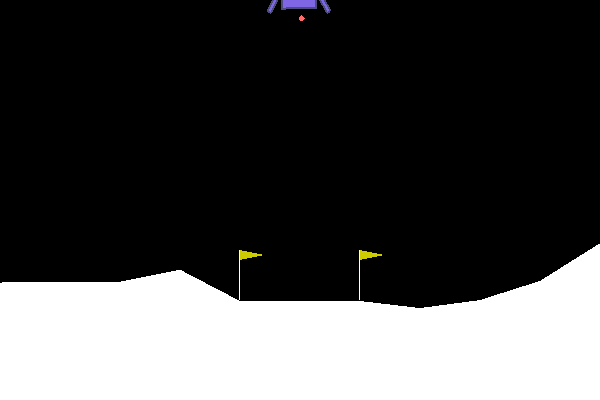
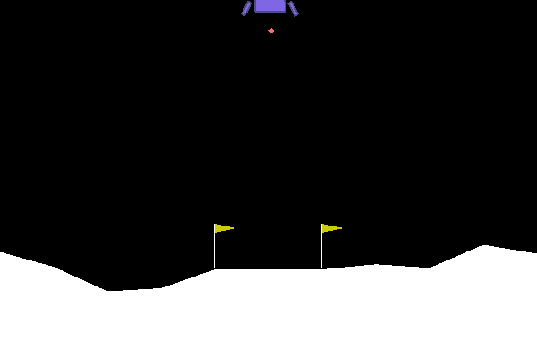

# Deep reinforcement learning - Homework 03
## by Tim Niklas Witte, Bhaskar Majumder, Moritz Lönker 

# Usage

# Evaluation
## Training

# Results
## 0 Episodes

## 100 Episodes

## 200 Episodes

## 300 Episodes

## 400 Episodes

## 500 Episodes

## 600 Episodes

