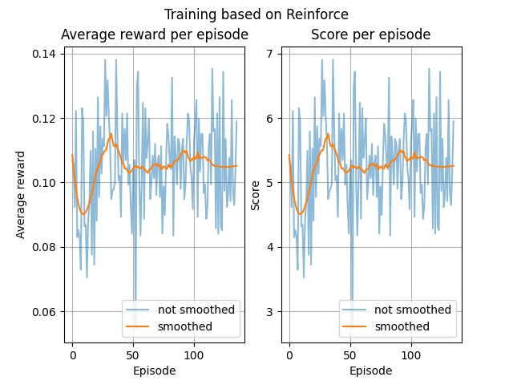
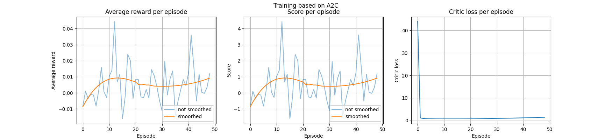
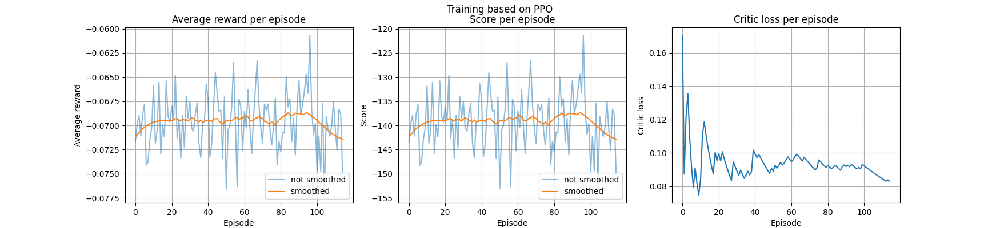

# Deep reinforcement learning - Homework 04
## by Tim Niklas Witte, Bhaskar Majumder, Moritz Lönker 

An agent (DQN) is trained on the [Car Racing environment of OpenAI Gym](
https://www.gymlibrary.ml/environments/box2d/car_racing/).
This training is based on the Reinforce, A2C and PPO algorithm.

## Evaluation

## Reinforce

## A2C

## PPO

